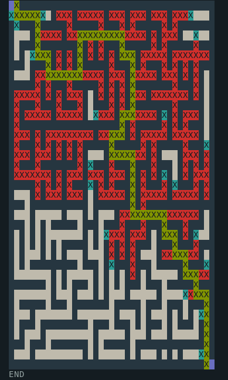
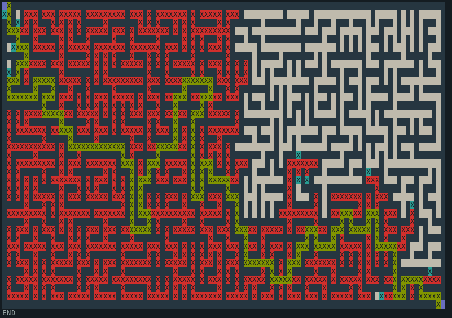

# a-star

    PathFinding - A* (A-Star) Implementation

This small project is an implementation of the A Star Algorithm of PathFinding.


## Usage

The program can be run with the following command : 

```
python app.py mazeFile.txt
python app.py mazeFile.txt nbFrames
```

### Arguments

- nbFrames : It's the frequency of display. 
    - If too big, you will mostly only see the final path on small mazes.
    - If too low, it will take longer to display all the work on big mazes.
- mazeFile.txt : should contains only 0 and 1, with 1 a traversable cell, and 0 a wall.

Also, entrypoint is at very top-left, and exitpoint is at very bottom-right.


## Examples

`python app.py samples maze1.txt`




`python app.py samples maze1.txt 100`

